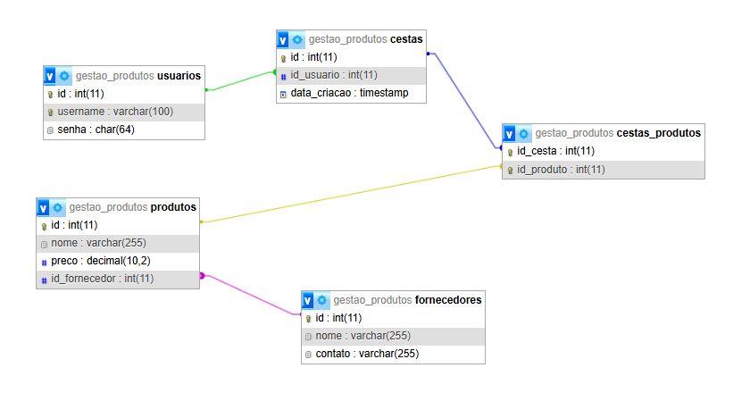
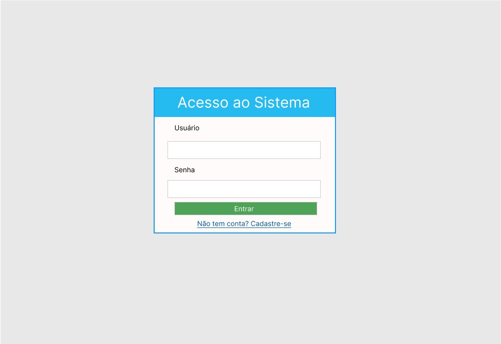
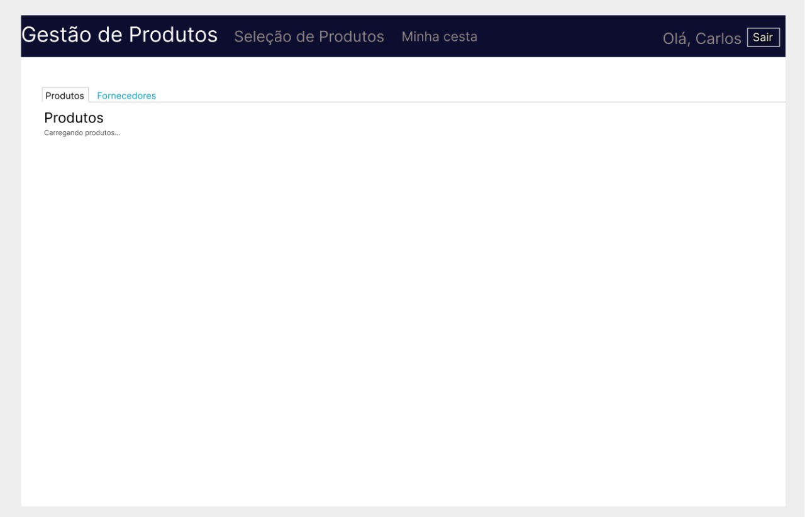
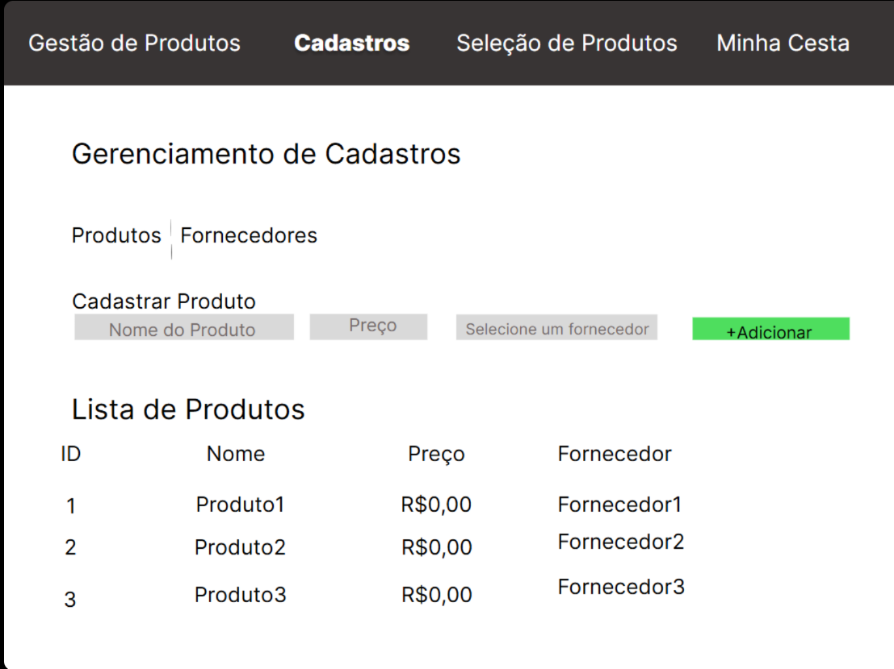
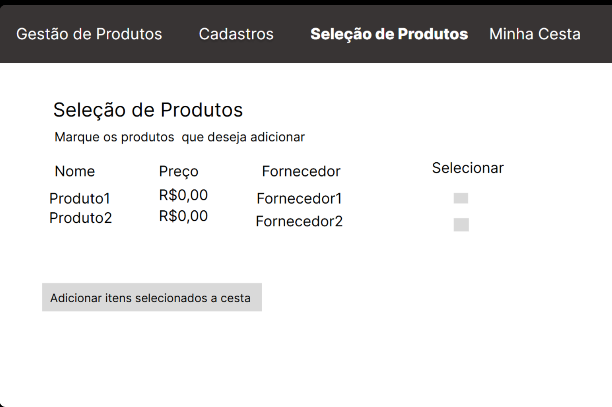

# crud-products
# Mini Sistema de Gestão de Produtos e Cesta de Compras

## 1. Identificação e Resumo do Projeto

| Item | Detalhe |
| :--- | :--- |
| **Título do Projeto** | Sistema de Gestão de Produtos com Cesta de Compras |
| **Descrição Funcional** | Gerencia o catálogo de produtos e fornecedores (CRUD completo) e permite a criação de cestas de compras por usuários autenticados, com cálculo de valor total e contagem de itens. |

### Membros da Equipe

| Nome Completo | RA |
| :--- | :--- |
| **Paulo Ricardo de Almeida** | 60003436 |
| **Felipe Coronato** | 60300641 |
| **Leonardo Fontana da Silva** | 60003437 |

---

## 2. Modelagem e Análise (Requisitos)

### 2.1 Diagrama Entidade-Relacionamento (DER)

O modelo de dados implementa o relacionamento **N:M (Muitos para Muitos)** entre Cestas e Produtos, através da tabela `cestas_produtos`.

### 2.2 Esboços de Telas (Wireframes Figma)

Os esboços visuais das áreas principais do sistema.

#### Tela de Login 

#### Tela de Geral 

#### Tela de Cadastros (CRUD)

#### Tela de Seleção

---

## 3. Implementação: Setup e Acesso

### 3.1 Requisitos Tecnológicos

| Tecnologia | Padrão |
| :--- | :--- |
| **Backend** | PHP 7.4+ (OO e PDO) |
| **Banco de Dados** | MySQL |
| **Frontend** | HTML, CSS, JavaScript (jQuery), Bootstrap 5 |
| **Segurança** | Senhas com HASH SHA-256 |

### 3.2 Instruções de Configuração

1.  **Pré-requisitos:** Inicie os serviços **Apache** e **MySQL** no seu servidor local (XAMPP/WAMP).
2.  **Banco de Dados:** Crie o banco de dados chamado **`gestao_produtos`** e execute o código SQL completo do projeto (localizado na pasta raiz).
3.  **Acesso:** Acesse o sistema pelo navegador em `http://localhost/seu-projeto/index.php`.

**Credenciais de Acesso Rápido:**
* **Usuário:** `admin`
* **Senha:** `123456`
